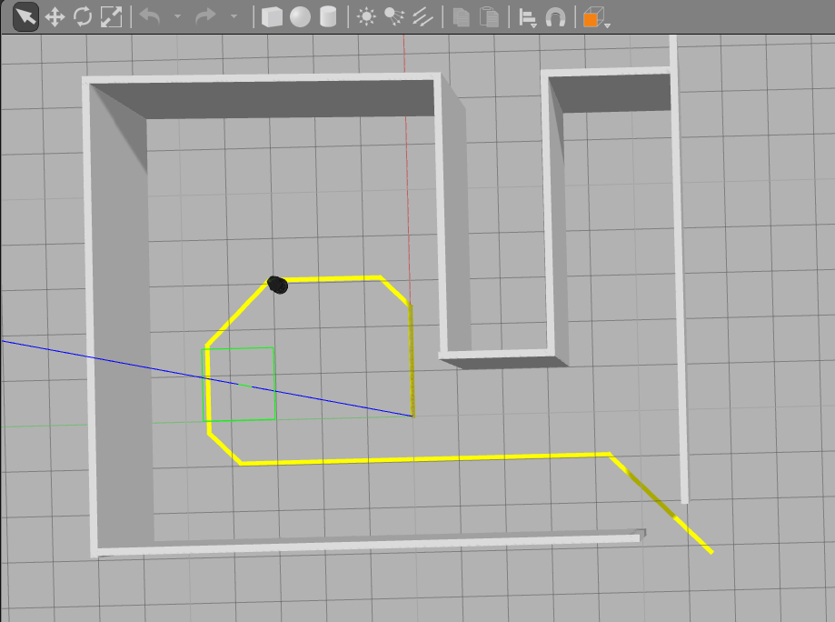
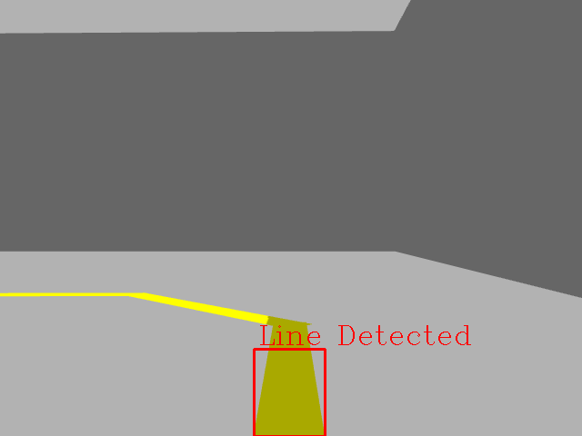
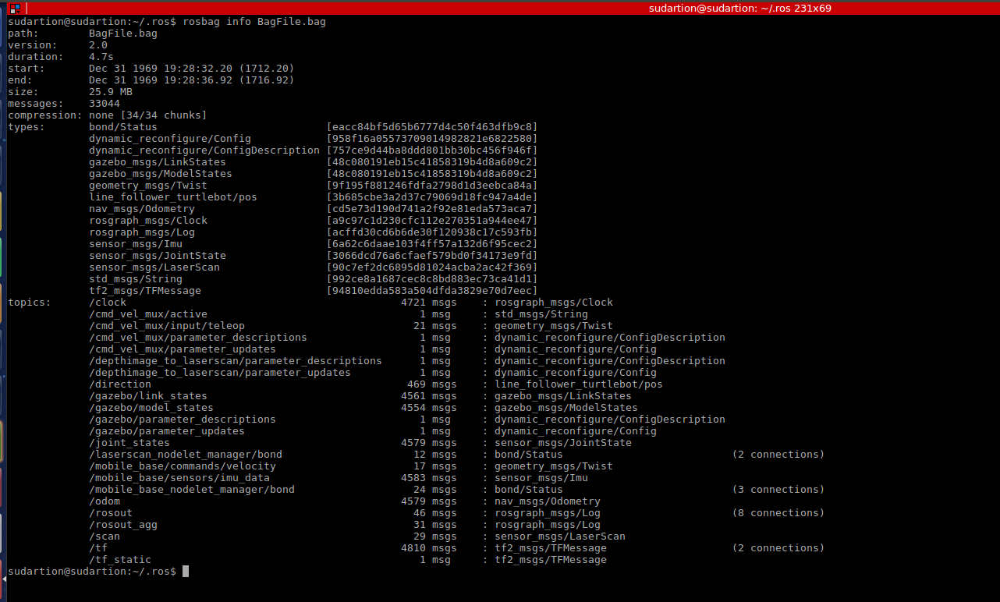

# Line Follower TurtleBot
[](https://travis-ci.org/sudrag/line_follower_turtlebot)
[](https://opensource.org/licenses/MIT)
[](https://coveralls.io/github/sudrag/line_follower_turtlebot?branch=master)

## Overview
This project uses ROS to demonstrate a simple line following Turtlebot in a simulated Gazebo environment . Line following is an easy to design application for a robot as all it requires is a robot with a camera and some tape. However this can be used to create complex high level models using multiple robots and multiple paths. This can be implemented in industries and shop floors for material handling and distribution. These robots can be made to follow these paths in periodic intervals autonomously and hence automate the function of the entire material handling system in a highly cost efficient way. This is the project that has been proposed to ACME robotics and the process has been explained below

## Procedure
Initially a Gazebo world was created containing some walls and a path for the turtlebot to follow. The world can be seen below:



This project primarily uses two main classes , one for the detection of the line and one for the navigation of the robot to do so. The detection class first and foremost obtains an image from the turtlebot in the simulated environment , performs color thresholding , masking and centroid detection to communicate the required direction for the robot to move in . The direction is determined based on the position of the centroid of the detected line with respect to the turtlebot .The direction commands are either move forward , turn left , turn right or search i.e spin on spot when no line is detected. The direction published by the detection class is used by the navigation class to publish velocity commands to the Turtlebot and successfully follow the line throughout the environment. Once the Turtlebot reaches the end of the path , it searches for a line to follow again by rotating on spot. This way it finds the same path it took and returns back to the starting point. This way travelling between these points is performed continuously and can be extremely beneficial in any material handling applications. The procedure follows the algorithm shown in the picture below.


The output from the turtlebot camera can be seen below. The image processing is performed from the images obtained from this camera.



## Dependencies

* ROS Kinetic
* Catkin
* roscpp package
* std_msgs package
* message_generation package
* OpenCV

## To build
To build the project run the following steps in a terminal:
* Creating a catkin workspace:
```
mkdir catkin_ws
cd catkin_ws
mkdir src
catkin_make
```
* Cloning the repository and building:
```
cd ~/catkin_ws/src
git clone https://github.com/sudrag/line_follower_turtlebot.git
cd ..
catkin_make
```

## To run
To run the project and see the output in the gazebo world , execute the following steps:
```
cd ~/catkin_ws
source devel/setup.bash
roslaunch line_follower_turtlebot lf.launch
```

The output generated will be launched in gazebo with one image viewer window similar to this:

<a href="https://imgflip.com/gif/214xo9"></a>

The terminal's output will be similar to:

> [ INFO] [1513353661.823250213, 2031.649000000]: Turning Left   
> [ INFO] [1513353662.039177398, 2031.850000000]: Straight    
> [ INFO] [1513353662.243911768, 2032.049000000]: Straight   
> ...


## Known Issues and Future Improvements
* Due to the limitation of the location of the camera on the turtlebot the camera image cannot see lines right underneath it and only see the lines a little ahead of it. This causes the robot to have to turn before it actually even reaches the turn thus undercutting the turns. This limitation can be fixed by relocating the base camera a little closer to the ground on the turtlebot. This was a tough task in the Gazebo world due to the relations that need to be maintained for the turtlebot base_links, camera_links etc. Due to the height of the camera the image also had to be masked to prevent intervention from the future turns. 
* Issues with generating coveralls . There were a lot of issues with getting travis to build for this project due to the fact that it used ROS Kinetic and OpenCV3 and hence a docker had to be used to complete the build . The inclusion of `Coveralls` with Travis for this combination of dependancies in a docker is not well documented online and a few attempts to recreate coverall scripts from different repositories failed.
* The project currently uses a "Bang-bang" type controller which produces the required output but however has very sharp changes in velocity for the Turtlebot. This can be improved by using controllers such as PIDs to have a smoother velocity profile for the robot.

## Demonstration

The entire project has been demonstrated using a video and a presenation which can be accessed from below :

[Project slides](https://docs.google.com/presentation/d/11z-mdd0ryByFo7QvxdRwzsLcfOYla6HGPNmMSVBkpIM/edit?usp=sharing)    
[Demonstration video](https://www.youtube.com/watch?v=n7LSSjZyFvE&feature=youtu.be)


## Testing
To run the gtest based unit tests for the classes in the project , run the following commands:

```
cd ~/catkin_ws
cp -R ~/catkin_ws/src/line_follower_turtlebot/test_images/ ~/catkin_ws/devel/lib/line_follower_turtlebot/
source devel/setup.bash
catkin_make run_tests
```
There are 10 unit tests overall which should all pass when you follow the commands mentioned above

### Testing code coverage

Due to issues with getting coveralls working for this project, a section has been added discussing the code coverage of the tests and how to generate the lcov files to view the percentage of the code covered.

The current coverage for the project is 98.4% . To generate the html file to view the coverage for this code , run the following steps:
```
cd ~/catkin_ws/build
lcov --directory . --capture --output-file coverage.info
sudo lcov --remove coverage.info '/opt/*' '/usr/*' '*/devel/*' '*test_*' '*_test*' --output-file coverage.info
lcov --list coverage.info
```
This will list the coverage info in the terminal. For better visualization it is recommended to generate an html file using :
```
genhtml coverage.info --output-directory out
```
This will generate a file called `index.html` in a folder called `out` in the building directory which contains all the coverage details.

If the coverage.info shows a lesser coverage it is due to the fact that some folders were not removed from the coverage. The files in those folder are used in the workspace but are not tested because they are not user written.

## Doxygen Documentation
To generate Doxygen Documentation in HTML and LaTEX, execute the following steps:
```
cd ~/catkin_ws/src/line_follower_turtlebot
mkdir <documentation_folder>
cd <documentation_folder>
doxygen -g <config_file_name>
```
Make the following changes inside the configuration file

> PROJECT_NAME = 'your project name'   
> INPUT = ../src ../include ../test    

The doxygen documents can be generated in the current directory (unless output directory is modified in the config file) using:
```
doxygen <config_file_name>
```
To view the documents easily, access the index.html file with your browser. For further information on the Doxygen Documentation: [Doxygen generation](http://flcwiki.desy.de/How%20to%20document%20your%20code%20using%20doxygen)

The Doxygen files for this project have already been generated and can be viewed [here.](docs/html/index.html)


## Bag File

* A bag file can be generated for this project by adding a flag to the launch file. The bag file generated will record all topics other than the camera images as it would make the file way too large. To generate the bag file, run the following steps:
```
cd ~/catkin_ws
source devel/setup.bash
roslaunch line_follower_turtlebot lf.launch StartRec:=true
```

This creates a bag file called *BagFile.bag* in the *.ros* folder. To view the file:

```
cd ~/.ros
rosbag info BagFile.bag
```
This displays the information about the bag file and looks like:



This repository contains a sample bag file that is 5 seconds long in the `Results` folder. To view the info of the bag file , type these steps in a terminal :
```
cd ~/catkin_ws/src/line_follower_turtlebot/Results
rosbag info Bagfile.bag
```

## Solo-Iterative Processes
This project was designed and developed using the SIP process. Tasks were organized after being identified and split up. The Product backlog,Iteration backlog , Time log and Defect log were recorded for each task and can be viewed in the link below:   
[SIP](https://docs.google.com/spreadsheets/d/1h3F1r1M49jn2B5hGm8tdiEN89Jc4dYUAVsPbGB_VrtQ/edit?usp=sharing)

* Iteration 1 Initialization and Planning
* Iteration 2 Code Development
* Iteration 3 Documentation and Testing

## Sprint Planning
This project is also developed with sprint planning notes and reviews which can be found in the link below:   
[Sprint Planning](https://docs.google.com/document/d/1q21Tg8Xpm63OooYd_8vvN_ifJ2BOtM1LuFxLneyHSGI/edit?usp=sharing)

## About the creator
Sudarshan Raghunathan , Graduate student in Robotics at University of Maryland , College Park. Currently working as a Research Assistant at the Medical Robotics Lab at UMD

## License
This project uses the MIT license as shown below:

```
MIT License

Copyright (c) 2017 Sudarshan Raghunathan

Permission is hereby granted, free of charge, to any person obtaining a copy of this software and associated documentation files (the "Software"), to deal in the Software without restriction, including without limitation the rights to use, copy, modify, merge, publish, distribute, sublicense, and/or sell copies of the Software, and to permit persons to whom the Software is furnished to do so, subject to the following conditions:

The above copyright notice and this permission notice shall be included in all copies or substantial portions of the Software.

THE SOFTWARE IS PROVIDED "AS IS", WITHOUT WARRANTY OF ANY KIND, EXPRESS OR IMPLIED, INCLUDING BUT NOT LIMITED TO THE WARRANTIES OF MERCHANTABILITY, FITNESS FOR A PARTICULAR PURPOSE AND NONINFRINGEMENT. IN NO EVENT SHALL THE AUTHORS OR COPYRIGHT HOLDERS BE LIABLE FOR ANY CLAIM, DAMAGES OR OTHER LIABILITY, WHETHER IN AN ACTION OF CONTRACT, TORT OR OTHERWISE, ARISING FROM, OUT OF OR IN CONNECTION WITH THE SOFTWARE OR THE USE OR OTHER DEALINGS IN THE SOFTWARE.
```
